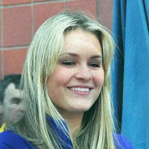

# 🛡️ Harnessing AI for Deepfake Detection in Images and Videos

> An AI-powered web application for detecting manipulated **images and videos** using Deep Learning, Computer Vision, CNN-based image classification, InceptionV3 feature extraction, and GRU-based temporal analysis.

---

## Project Overview

The rapid development of Artificial Intelligence and Generative AI has made it possible to create highly realistic manipulated images and videos, commonly known as **deepfakes**.

Deepfake media can be difficult to distinguish from authentic content and can be misused for misinformation, impersonation, fraud, privacy violations, and other malicious activities.

This project, **Harnessing AI for Deepfake Detection in Images and Videos**, develops a web-based AI system that allows users to upload an image or video and determine whether the uploaded media is **REAL** or **FAKE**.

The project contains two major detection approaches:

* 🖼️ **Image Deepfake Detection** using CNN-based classification
* 🎥 **Video Deepfake Detection** using InceptionV3 feature extraction and GRU-based temporal sequence analysis

The system is integrated into a **Flask web application** with a **MySQL database** for user registration and login.


**Project DEMO**


---

# 🎯 Objectives

The main objectives of this project are:

* Detect manipulated images using deep learning.
* Detect manipulated videos using temporal analysis.
* Extract meaningful visual features from images and video frames.
* Use CNN architectures for image classification.
* Explore pretrained architectures such as VGG16 and MobileNet.
* Use InceptionV3 for video frame feature extraction.
* Use GRU networks to analyze temporal relationships between video frames.
* Develop a user-friendly web interface for uploading media.
* Provide an automated REAL/FAKE prediction.
* Integrate authentication using Flask and MySQL.

---

# 💡 Problem Statement

The increasing availability of AI-based image and video generation tools has made digital media manipulation easier and more realistic.

Traditional methods of manually identifying manipulated content are often unreliable because modern deepfakes can contain subtle visual and temporal inconsistencies that are difficult for humans to detect.

Therefore, there is a need for an automated system that can analyze digital media and identify whether it is authentic or manipulated.

This project addresses the problem by applying deep learning techniques to both **static images** and **video sequences**.

---

# 🚀 Key Features

### 🖼️ Image Detection

* Upload an image through the web application.
* Resize the image to `256 × 256`.
* Normalize image pixel values.
* Pass the processed image to the trained CNN model.
* Classify the image as:

  * `Fake`
  * `Real`

### 🎥 Video Detection

* Upload a video through the web application.
* Extract frames from the video using OpenCV.
* Crop frames into center squares.
* Resize frames to `224 × 224`.
* Extract visual features using pretrained InceptionV3.
* Process up to 20 frames per video sequence.
* Pass frame features to a GRU-based sequence model.
* Classify the video as:

  * `FAKE`
  * `REAL`

### 🔐 User Authentication

The application provides:

* User registration
* User login
* Password confirmation
* Existing email validation
* MySQL database integration

### 🌐 Web Application

The project provides separate pages for:

* Home
* Login
* Registration
* Image detection
* Video detection
* Prediction results

---

# 🏗️ System Architecture

The overall architecture of the project can be represented as:

```text
                         ┌─────────────────────┐
                         │      Web User       │
                         └──────────┬──────────┘
                                    │
                                    ▼
                         ┌─────────────────────┐
                         │   Flask Web App     │
                         └──────────┬──────────┘
                                    │
                     ┌──────────────┴──────────────┐
                     │                             │
                     ▼                             ▼
              ┌──────────────┐              ┌──────────────┐
              │ Image Upload │              │ Video Upload │
              └──────┬───────┘              └──────┬───────┘
                     │                             │
                     ▼                             ▼
              ┌──────────────┐              ┌──────────────┐
              │ Preprocessing│              │Frame Extraction│
              └──────┬───────┘              └──────┬───────┘
                     │                             │
                     ▼                             ▼
              ┌──────────────┐              ┌──────────────┐
              │  CNN Model   │              │  InceptionV3 │
              └──────┬───────┘              └──────┬───────┘
                     │                             │
                     │                             ▼
                     │                     ┌──────────────┐
                     │                     │ Frame Features│
                     │                     └──────┬───────┘
                     │                            │
                     │                            ▼
                     │                     ┌──────────────┐
                     │                     │     GRU      │
                     │                     └──────┬───────┘
                     │                            │
                     └──────────────┬─────────────┘
                                    ▼
                           ┌─────────────────┐
                           │    Prediction   │
                           └────────┬────────┘
                                    │
                            ┌───────┴────────┐
                            ▼                ▼
                          REAL             FAKE
```

---

# 🧠 Deep Learning Approach

## 1. Image Deepfake Detection

The image detection component uses a CNN-based classification approach.

Images are first loaded and resized to:

```text
256 × 256 × 3
```

The pixel values are normalized using:

```python
x /= 255
```

The trained CNN model then predicts the class.

The prediction classes used in the application are:

```python
classes = ["Fake", "Real"]
```

The class with the highest predicted probability is selected using:

```python
np.argmax(results)
```

### Image Pipeline

```text
Input Image
     │
     ▼
Resize to 256 × 256
     │
     ▼
Convert to Array
     │
     ▼
Normalize Pixel Values
     │
     ▼
CNN Model
     │
     ▼
Classification
     │
 ┌───┴────┐
 ▼        ▼
Fake     Real
```

---

# 🧠 CNN Model

A custom CNN architecture was implemented during the project.

The CNN contains convolutional layers followed by pooling and classification layers.

The architecture uses components such as:

* `Conv2D`
* `MaxPool2D`
* `Flatten`
* `Dense`

The CNN learns visual patterns that can help differentiate authentic and manipulated images.

---

# 🔬 VGG16 Experiment

The project also explores **VGG16** as a pretrained CNN architecture.

VGG16 is loaded with ImageNet weights without its original classification head.

The project adds:

```text
VGG16
   ↓
GlobalAveragePooling2D
   ↓
Dense(64, ReLU)
   ↓
BatchNormalization
   ↓
Dropout(0.2)
   ↓
Dense(2)
```

The VGG16 model is trained using:

* Adam optimizer
* Categorical Crossentropy
* Accuracy
* Precision
* Recall
* Sensitivity
* Specificity

The model is trained for 15 epochs in the notebook.

---

# ⚡ MobileNet Experiment

MobileNet is also explored as a lightweight pretrained CNN architecture.

The architecture used in the project is:

```text
MobileNet
   ↓
GlobalAveragePooling2D
   ↓
Dense(64, ReLU)
   ↓
BatchNormalization
   ↓
Dropout(0.2)
   ↓
Dense(2)
```

MobileNet provides a computationally lighter alternative for extracting image features.

The model is trained using:

* Adam optimizer
* Categorical Crossentropy
* Accuracy
* Precision
* Recall
* Sensitivity
* Specificity

The model is trained for 15 epochs in the notebook.

---

# 🎥 Video Deepfake Detection

Video detection is different from image detection because videos contain **temporal information**.

A video is composed of a sequence of frames:

```text
Frame 1 → Frame 2 → Frame 3 → ... → Frame 20
```

Instead of treating every frame independently, this project extracts features from video frames and then uses a GRU network to analyze the sequence.

---

# 🔍 Video Processing Pipeline

The video processing pipeline consists of four major stages:

### 1. Frame Extraction

OpenCV is used to read the uploaded video.

```python
cv2.VideoCapture()
```

Frames are extracted from the video.

---

### 2. Frame Preprocessing

Each frame is:

* Center-cropped
* Resized to `224 × 224`
* Converted into RGB format

The project uses:

```text
IMG_SIZE = 224
```

---

### 3. Feature Extraction Using InceptionV3

A pretrained InceptionV3 model is used as the feature extractor.

The model is configured with:

```python
include_top=False
pooling="avg"
weights="imagenet"
```

The resulting feature representation contains:

```text
2048 features per frame
```

The project defines:

```text
NUM_FEATURES = 2048
```

---

### 4. Temporal Analysis Using GRU

The extracted features from the video frames are passed into a GRU-based sequence model.

The model architecture is:

```text
Input
 │
 ▼
GRU(16, return_sequences=True)
 │
 ▼
GRU(8)
 │
 ▼
Dropout(0.4)
 │
 ▼
Dense(8, ReLU)
 │
 ▼
Dense(1, Sigmoid)
 │
 ▼
REAL / FAKE
```

The model uses:

```python
loss="binary_crossentropy"
optimizer="adam"
metrics=["accuracy"]
```

---

# 🔄 Video Sequence Processing

The system processes a maximum of:

```text
20 frames per video
```

The configuration is:

```python
MAX_SEQ_LENGTH = 20
NUM_FEATURES = 2048
```

If a video contains fewer than 20 frames, masking is used to identify the valid frames.

This allows the GRU to process sequences with different lengths.

---

# 📊 Prediction Logic

For video prediction, the trained model produces a probability value.

The application uses the following decision logic:

```python
if prediction >= 0.8:
    predicted_class = 'FAKE'
else:
    predicted_class = 'REAL'
```

Therefore:

```text
Prediction ≥ 0.8  → FAKE
Prediction < 0.8  → REAL
```

---

# 🧪 Model Evaluation

The project evaluates the image models using several classification metrics.

### Accuracy

Measures the proportion of correctly classified samples.

### Precision

Measures the correctness of positive predictions.

### Recall

Measures the ability to identify positive samples.

### Sensitivity

Measures the ability to correctly identify positive cases at a selected specificity level.

### Specificity

Measures the ability to correctly identify negative cases at a selected sensitivity level.

### Confusion Matrix

A confusion matrix is also used to analyze classification performance.

The project includes code for generating both normalized and non-normalized confusion matrices.

---

# 🗂️ Dataset

## Image Dataset

The image notebook expects the dataset to be organized into training and testing directories:

```text
dataset/
│
├── train/
│   ├── Fake/
│   └── Real/
│
└── test/
    ├── Fake/
    └── Real/
```

The image data is loaded using:

```python
ImageDataGenerator
```

Images are resized to:

```text
256 × 256
```

and pixel values are rescaled using:

```python
1./255
```

---

## Video Dataset

The video model was developed using metadata containing video labels such as:

```text
FAKE
REAL
```

The video data is divided into training and testing subsets using:

```python
train_test_split()
```

with stratification based on the video labels.

The testing portion is created using:

```python
test_size=0.1
random_state=42
```

---

# 🛠️ Technology Stack

| Category                 | Technology             |
| ------------------------ | ---------------------- |
| Programming Language     | Python                 |
| Web Framework            | Flask                  |
| Deep Learning            | TensorFlow / Keras     |
| Computer Vision          | OpenCV                 |
| Image Processing         | Pillow                 |
| Numerical Computing      | NumPy                  |
| Data Processing          | Pandas                 |
| Visualization            | Matplotlib             |
| Visualization            | Seaborn                |
| Machine Learning         | Scikit-learn           |
| Image Models             | CNN, VGG16, MobileNet  |
| Video Feature Extraction | InceptionV3            |
| Sequence Model           | GRU                    |
| Frontend                 | HTML, CSS, JavaScript  |
| UI Framework             | Bootstrap              |
| Database                 | MySQL                  |
| Database Connector       | MySQL Connector/Python |
| Model Format             | H5                     |
| Development              | Jupyter Notebook       |

---

# 🌐 Web Application

The trained models are integrated into a Flask web application.

The application provides a simple interface where users can:

1. Register an account.
2. Log in.
3. Access the detection dashboard.
4. Upload an image.
5. Upload a video.
6. Receive the prediction.

---

# 🔐 Authentication System

The project uses MySQL for storing user credentials.

The database is named:

```text
video_detection
```

The database contains a `users` table:

```text
users
│
├── id
├── email
└── password
```

The SQL database setup is provided in:

```text
db.sql
```

---

# 📁 Project Structure

The repository contains the following major components:

```text
HARNESSING-AI-FOR-DEEP-FAKE-DETECTION-IN-IMAGES-and-VIDEOS/
│
├── app.py
│
├── CODE.ipynb
├── model.ipynb
│
├── model.h5
├── checkpoint
│
├── db.sql
│
├── index.html
├── home.html
├── login.html
├── image.html
├── video.html
│
├── bootstrap.min.css
├── bootstrap.min.js
├── bootstrap-icons.css
├── bootstrap-icons.woff
├── bootstrap-icons.woff2
│
├── custom.js
├── click-scroll.js
├── jquery.min.js
├── jquery.sticky.js
│
├── templatemo-festava-live.css
│
├── background.mp4
├── pexels-2022395.mp4
│
├── *.jpg
│
└── README.md
```

> The trained image model and the video model used by `app.py` are expected under the application's `Models/` directory.

---

# ⚙️ Installation

## 1. Clone the Repository

```bash
git clone https://github.com/krupabt/HARNESSING-AI-FOR-DEEP-FAKE-DETECTION-IN-IMAGES-and-VIDEOS.git
```

Navigate to the project:

```bash
cd HARNESSING-AI-FOR-DEEP-FAKE-DETECTION-IN-IMAGES-and-VIDEOS
```

---

# 🐍 Create a Virtual Environment

### Windows

```bash
python -m venv venv
```

Activate it:

```bash
venv\Scripts\activate
```

### Linux / macOS

```bash
python3 -m venv venv
```

```bash
source venv/bin/activate
```

---

# 📦 Install Dependencies

Install the required Python packages:

```bash
pip install flask
pip install mysql-connector-python
pip install tensorflow
pip install opencv-python
pip install pillow
pip install numpy
pip install pandas
pip install matplotlib
pip install seaborn
pip install scikit-learn
```

Or create a `requirements.txt` file containing the required packages and install them using:

```bash
pip install -r requirements.txt
```

---

# 🗄️ MySQL Database Setup

Make sure MySQL is installed and running.

The project uses:

```text
Database: video_detection
```

Open MySQL and execute:

```sql
drop database if exists video_detection;

create database video_detection;

use video_detection;

create table users (
    id INT PRIMARY KEY AUTO_INCREMENT,
    email VARCHAR(50),
    password VARCHAR(50)
);
```

The complete SQL script is available in:

```text
db.sql
```

---

# 🔧 Database Configuration

The Flask application currently connects to MySQL using:

```python
mydb = mysql.connector.connect(
    host="localhost",
    user="root",
    password="",
    port="3306",
    database="video_detection"
)
```

Update the database credentials in `app.py` according to your local MySQL configuration.

---

# 🤖 Model Files

The Flask application loads trained models from the `Models` directory.

The application expects:

```text
Models/
│
├── cnn.h5
└── model.h5
```

### `cnn.h5`

Used for image deepfake classification.

### `model.h5`

Used for video deepfake classification.

The notebooks contain the model development and training process.

---

# ▶️ Running the Application

After configuring Python, TensorFlow, MySQL, and the trained models:

```bash
python app.py
```

Flask will start the development server.

Open the local application in your browser using the address shown by Flask, typically:

```text
http://127.0.0.1:5000/
```

---

# 🖥️ Application Workflow

## Step 1 — Home Page

The application opens with the Deep Fake Detection landing page.

```text
Home
  │
  ▼
Login
```

---

## Step 2 — Registration

New users can create an account using:

* Email
* Password
* Confirm Password

The registration information is stored in MySQL.

---

## Step 3 — Login

Registered users can log in using their credentials.

After successful authentication, the user is redirected to the detection dashboard.

---

## Step 4 — Choose Detection Type

The application provides two detection options:

```text
        Detection
            │
       ┌────┴────┐
       ▼         ▼
     Image     Video
```

---

## Step 5 — Image Prediction

Upload an image.

The application:

```text
Upload Image
     ↓
Save Image
     ↓
Resize
     ↓
Normalize
     ↓
CNN Model
     ↓
Prediction
     ↓
Fake / Real
```

---

## Step 6 — Video Prediction

Upload a video.

The application:

```text
Upload Video
     ↓
Save Video
     ↓
Extract Frames
     ↓
Center Crop
     ↓
Resize to 224×224
     ↓
InceptionV3
     ↓
2048-D Features
     ↓
GRU
     ↓
Prediction
     ↓
FAKE / REAL
```

---

# 📸 Application Screens

The repository contains screenshots and media files demonstrating the project interface and results.

You can add screenshots to this README using:

```markdown

```

```markdown

```

```markdown

```

Replace the filenames with the screenshots you want to showcase.

---

# 📈 Project Workflow Summary

```text
                    USER
                     │
                     ▼
              Flask Web App
                     │
              ┌──────┴──────┐
              │             │
              ▼             ▼
          Register        Login
              │             │
              └──────┬──────┘
                     ▼
                Home Page
                     │
             ┌───────┴────────┐
             │                │
             ▼                ▼
       Image Detection   Video Detection
             │                │
             ▼                ▼
          CNN Model       Frame Extraction
             │                │
             │                ▼
             │            InceptionV3
             │                │
             │                ▼
             │          Feature Vectors
             │                │
             │                ▼
             │               GRU
             │                │
             └────────┬───────┘
                      ▼
                  Prediction
                      │
               ┌──────┴──────┐
               ▼             ▼
             REAL          FAKE
```

---

# 🔬 Important Technical Details

### Image Processing

```text
Input Size: 256 × 256
Channels: 3 (RGB)
Normalization: 1./255
Classification: Fake / Real
```

### Video Processing

```text
Frame Size: 224 × 224
Maximum Sequence Length: 20
Feature Size: 2048
Feature Extractor: InceptionV3
Sequence Model: GRU
Output: Binary Classification
```

### GRU Architecture

```text
GRU(16, return_sequences=True)
            ↓
          GRU(8)
            ↓
        Dropout(0.4)
            ↓
       Dense(8, ReLU)
            ↓
     Dense(1, Sigmoid)
```

---

# 📚 Project Files

### `app.py`

Main Flask application containing:

* Flask routes
* User registration
* Login
* MySQL connectivity
* Image prediction
* Video prediction
* Video preprocessing
* Model loading

### `CODE.ipynb`

Notebook containing the image deepfake detection experiments, including:

* Data loading
* Image preprocessing
* CNN
* VGG16
* MobileNet
* Model training
* Evaluation metrics
* Model saving

### `model.ipynb`

Notebook containing the video deepfake detection pipeline, including:

* Video metadata
* Frame extraction
* Video preprocessing
* InceptionV3 feature extraction
* GRU sequence modeling
* Model training
* Video prediction

### `db.sql`

SQL script for creating the MySQL database and users table.

### `image.html`

Frontend page for image uploading and displaying image predictions.

### `video.html`

Frontend page for video uploading and displaying video predictions.

### `home.html`

Main dashboard/home page after login.

---

# ⚠️ Limitations

Although the project provides an AI-based approach to deepfake detection, it has some limitations.

### Dataset Dependency

The model's performance depends heavily on the datasets used for training.

### Evolving Deepfake Techniques

New generation techniques may produce manipulations that the trained model has not encountered.

### Computational Requirements

Deep learning models such as InceptionV3 can require significant computational resources.

### Video Processing Time

Processing multiple video frames can take longer than processing a single image.

### Prediction Uncertainty

A model prediction should not be considered absolute proof that media is genuine or manipulated.

---

# 🚀 Future Enhancements

Several improvements can be made to extend this project.

### 1. Real-Time Video Detection

Implement real-time detection using webcam or live video streams.

### 2. Improved CNN Architectures

Experiment with:

* ResNet
* EfficientNet
* Xception
* ConvNeXt

### 3. Transformer-Based Detection

Explore:

* Vision Transformers
* Video Transformers
* TimeSformer

### 4. Better Temporal Models

Compare GRU with:

* LSTM
* Bidirectional GRU
* Bidirectional LSTM
* Transformer-based sequence models

### 5. Explainable AI

Add visual explanations such as heatmaps to show regions contributing to a prediction.

### 6. Confidence Scores

Display the model's prediction probability to the user.

### 7. Audio Deepfake Detection

Extend the project to analyze synthetic or manipulated speech.

### 8. Multimodal Detection

Combine:

```text
Image
  +
Video
  +
Audio
  +
Facial Features
  +
Temporal Features
```

to create a more comprehensive media authenticity detection system.

### 9. Secure Authentication

Improve the authentication system by implementing:

* Password hashing
* Session management
* Environment variables
* Secure database configuration

### 10. Cloud Deployment

Deploy the application to a cloud platform so that users can access the detection system remotely.

---

# 🔐 Security Considerations

The project should be improved before being used in a production environment.

Important security improvements include:

* Never store passwords in plain text.
* Use password hashing.
* Store database credentials in environment variables.
* Validate uploaded file types.
* Restrict maximum upload size.
* Generate safe filenames for uploaded files.
* Avoid exposing sensitive uploaded media.
* Disable Flask debug mode in production.
* Use secure session management.

---

# 🌍 Real-World Applications

The technology demonstrated in this project can potentially be applied to:

* 📰 News media verification
* 🔐 Cybersecurity
* ⚖️ Digital forensics
* 📱 Social media moderation
* 🏦 Fraud detection
* 🏛️ Public information verification
* 🎓 Academic research
* 🛡️ Content authenticity systems

---

# 🎓 Learning Outcomes

This project provides practical experience with:

* Python
* Flask
* MySQL
* TensorFlow
* Keras
* CNN
* VGG16
* MobileNet
* InceptionV3
* GRU
* Computer Vision
* OpenCV
* Image preprocessing
* Video processing
* Transfer learning
* Deep learning model training
* Model evaluation
* Web application development
* Database integration

---

# 🏆 Project Highlights

| Area                     | Implementation                   |
| ------------------------ | -------------------------------- |
| Image Detection          | CNN                              |
| CNN Experiments          | CNN, VGG16, MobileNet            |
| Video Feature Extraction | InceptionV3                      |
| Video Sequence Modeling  | GRU                              |
| Image Size               | 256 × 256                        |
| Video Frame Size         | 224 × 224                        |
| Video Sequence           | Up to 20 frames                  |
| Video Feature Dimension  | 2048                             |
| Backend                  | Flask                            |
| Frontend                 | HTML, CSS, Bootstrap, JavaScript |
| Database                 | MySQL                            |
| Image Classification     | Fake / Real                      |
| Video Classification     | FAKE / REAL                      |

---

# 📌 Conclusion

**Harnessing AI for Deepfake Detection in Images and Videos** demonstrates the application of Deep Learning and Computer Vision techniques to the growing problem of manipulated digital media.

The project combines different approaches for different types of media.

For **images**, CNN-based classification is used, with experiments involving custom CNN, VGG16, and MobileNet architectures.

For **videos**, frames are extracted using OpenCV, visual features are generated using pretrained **InceptionV3**, and temporal relationships between frames are learned using a **GRU-based sequence model**.

These models are integrated into a **Flask web application**, allowing users to register, log in, upload images or videos, and receive an automated deepfake prediction.

The project provides a foundation for further development toward more advanced deepfake detection systems using larger datasets, improved architectures, transformer-based models, explainable AI, multimodal analysis, and real-time detection.

---

# 👩‍💻 Author

## Krupa B T

Information Science Engineering Student

### Areas of Interest

* Artificial Intelligence
* Machine Learning
* Deep Learning
* Computer Vision
* Data Science
* Software Development

### GitHub

[@krupabt](https://github.com/krupabt)

---

# ⭐ Repository

**Project Repository:**

https://github.com/krupabt/HARNESSING-AI-FOR-DEEP-FAKE-DETECTION-IN-IMAGES-and-VIDEOS

If you find this project useful, consider giving the repository a ⭐.

---

# 📄 License

This project is developed for **educational and research purposes**.

Before using the project commercially, review the licenses of the datasets, pretrained models, libraries, and third-party frontend resources used by the project.
